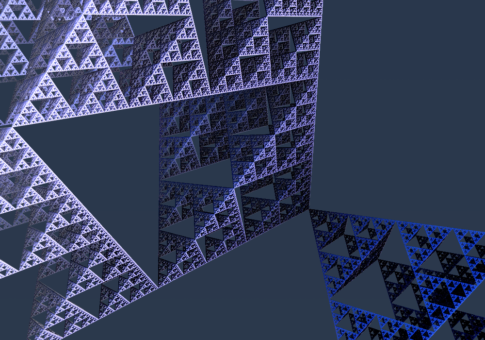
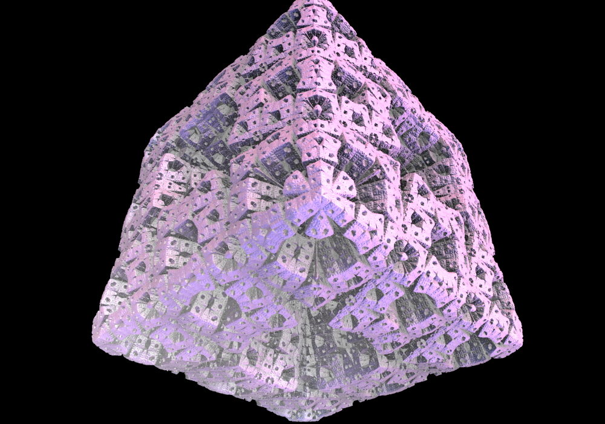

# WebGL-RayMarching
## Live Demo at [https://nemo1999.github.io/WebGL-RayMarching](https://nemo1999.github.io/WebGL-RayMarching)
A fractal demo based on ray-marching

- For more information about "Folding Space" by SDF, please see [this tutorial by Mikael Hvidtfeldt Christensen](http://blog.hvidtfeldts.net/index.php/2011/08/distance-estimated-3d-fractals-iii-folding-space/)

- For guides about ray-marching, see [Inigo Quilez's website](https://www.iquilezles.org/www/index.htm) .

- Current WebGL setting is highly inpired by [evan's path-tracing example](http://madebyevan.com/webgl-path-tracing/)

- Ray Tracing routine is modified from [Flux Core (shader toy)](https://www.shadertoy.com/view/ltlSWf) 

